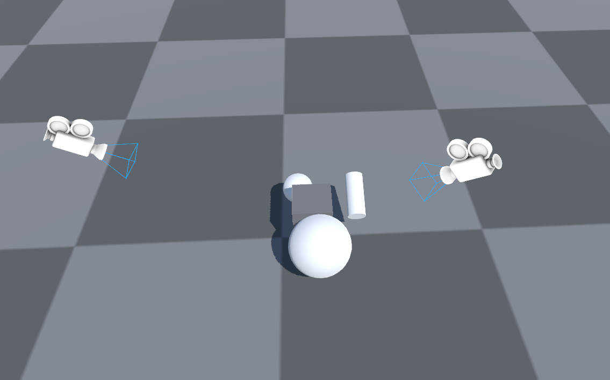
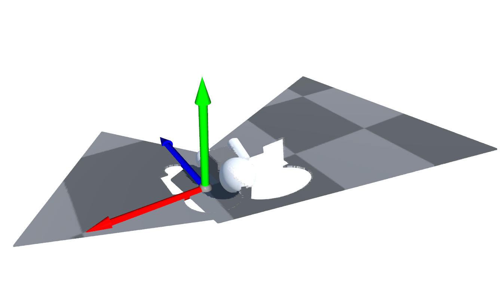
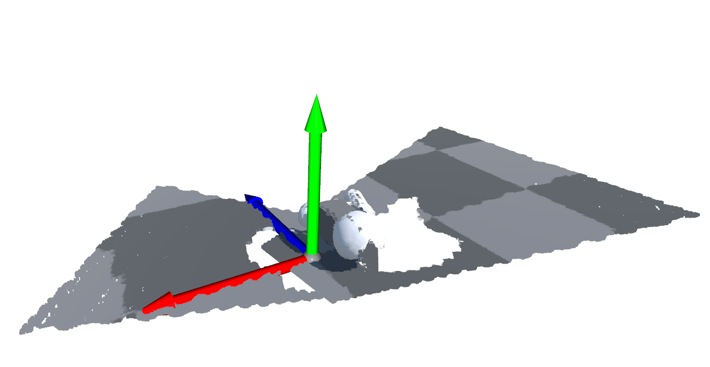
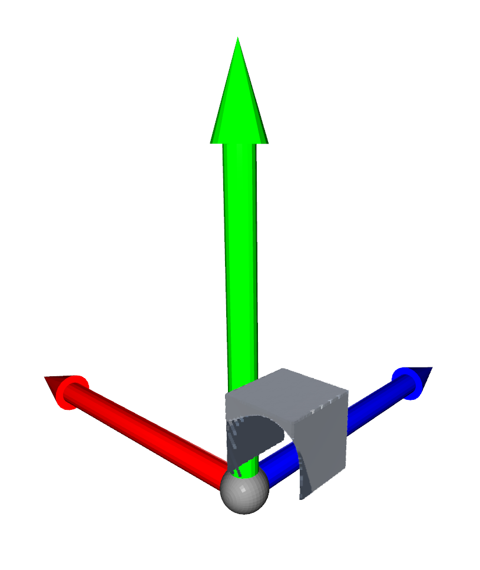

# test_active_depth.py

## 1. Basic Functionality



- With known camera intrinsic and extrinsic parameters, obtain both the infrared depth map and the real depth map of an object, convert them into point clouds, and visualize the results.

## 2. Implementation Process

### 2.1 Initialize the Environment

```python
nd_main_intrinsic_matrix = np.array([[600, 0, 240],
                                     [0, 600, 240],
                                     [0, 0, 1]])
nd_ir_intrinsic_matrix = np.array([[480, 0, 240],
                                   [0, 480, 240],
                                   [0, 0, 1]])

env = RFUniverseBaseEnv(scene_file="ActiveDepth.json", ext_attr=[ActiveLightSensorAttr])
active_light_sensor_1 = env.GetAttr(789789)
```

- Load the environment from a json file.
- Initialize the camera intrinsic matrices.
- Here, $f_x, f_y$ are equal, representing an ideal pinhole camera scenario.

### 2.2 Obtain Images

#### 2.2.1 Obtain RGB Image

```python
active_light_sensor_1.GetRGB(intrinsic_matrix=nd_main_intrinsic_matrix)
env.step()
image_byte = active_light_sensor_1.data["rgb"]
image_rgb = np.frombuffer(image_byte, dtype=np.uint8)
image_rgb = cv2.imdecode(image_rgb, cv2.IMREAD_COLOR)
image_rgb = cv2.cvtColor(image_rgb, cv2.COLOR_BGR2RGB)
```

#### 2.2.2 Obtain Object Semantic Segmentation Map

```python
active_light_sensor_1.GetID(intrinsic_matrix=nd_main_intrinsic_matrix)
env.step()
image_id = active_light_sensor_1.data["id_map"]
image_id = np.frombuffer(image_id, dtype=np.uint8)
image_id = cv2.imdecode(image_id, cv2.IMREAD_COLOR)
image_id = cv2.cvtColor(image_id, cv2.COLOR_BGR2RGB)
```

#### 2.2.3 Obtain Depth Map

```python
active_light_sensor_1.GetDepthEXR(intrinsic_matrix=nd_main_intrinsic_matrix)
env.step()
image_depth_exr = active_light_sensor_1.data["depth_exr"]

active_light_sensor_1.GetActiveDepth(
    main_intrinsic_matrix_local=nd_main_intrinsic_matrix,
    ir_intrinsic_matrix_local=nd_ir_intrinsic_matrix,
)
env.step()
image_active_depth = active_light_sensor_1.data["active_depth"]
```

- `GetDepthEXR` returns the depth map in EXR format, considered to be without error.
- `GetActiveDepth` simulates a real-world infrared depth camera, returning a depth map with errors.

### 2.3 Point Cloud Rendering

#### 2.3.1 Obtain the Camera's Extrinsic Matrix

```python
local_to_world_matrix = active_light_sensor_1.data["local_to_world_matrix"]
```

- `local_to_world_matrix`: The coordinate transformation matrix from camera local to world coordinate system, i.e., the camera's extrinsic matrix.

#### 2.3.2 Render Point Cloud Using the Error-Free Depth Map



```python
real_point_cloud1 = dp.image_bytes_to_point_cloud_intrinsic_matrix(
    image_byte, image_depth_exr, nd_main_intrinsic_matrix, local_to_world_matrix
)
```

- `image_bytes_to_point_cloud_intrinsic_matrix`: Generates a global coordinate system point cloud using the original byte-format RGB and depth images, along with the camera's intrinsic and extrinsic matrices.

#### 2.3.3 Render Point Cloud Using the Depth Map with Errors



```python
active_point_cloud1 = dp.image_array_to_point_cloud_intrinsic_matrix(
    image_rgb, image_active_depth, nd_main_intrinsic_matrix, local_to_world_matrix
)
```

- `image_array_to_point_cloud_intrinsic_matrix`: Generates a global coordinate system point cloud using numpy.ndarray-format RGB and depth images, along with the camera's intrinsic and extrinsic matrices.

#### 2.3.4 Segment Objects in the Point Cloud




```python
color = utility.EncodeIDAsColor(568451)[0:3]
mask_real_point_cloud1 = dp.mask_point_cloud_with_id_color(
    real_point_cloud1, image_id, color
)
mask_active_point_cloud1 = dp.mask_point_cloud_with_id_color(
    active_point_cloud1, image_id, color
)
```

- `mask_point_cloud_with_id_color`: Uses the previously generated object semantic segmentation map to segment target objects from the point cloud.

#### 2.3.5 Filter the Point Cloud with Errors for Improvement


```python
filtered_point_cloud1 = dp.filter_active_depth_point_cloud_with_exact_depth_point_cloud(
    mask_active_point_cloud1, mask_real_point_cloud1
)
```

- `filter_active_depth_point_cloud_with_exact_depth_point_cloud`: Uses the real depth map to filter and improve the point cloud generated from the depth map with errors.

#### 2.3.6 Repeat the Process for Another Viewpoint Camera

```python
active_light_sensor_2 = env.GetAttr(123123)

# Repeat the image capture and point cloud rendering steps for the second camera
# Finalize and close the environment
env.Pend()
env.close()
```

- Repeat the above process for another viewpoint camera.

### 2.4 Visualization

```python
# Transform from unity space to open3d space and display
# Apply transformations and visualize the different point clouds

coordinate = o3d.geometry.TriangleMesh.create_coordinate_frame()

o3d.visualization.draw_geometries([real_point_cloud1, real_point_cloud2, coordinate])
o3d.visualization.draw_geometries([active_point_cloud1, active_point_cloud2, coordinate])
o3d.visualization.draw_geometries([mask_real_point_cloud1, mask_real_point_cloud2, coordinate])
o3d.visualization.draw_geometries([mask_active_point_cloud1, mask_active_point_cloud2, coordinate])
o3d.visualization.draw_geometries([filtered_point_cloud1, filtered_point_cloud2, coordinate])
```

This tutorial segment demonstrates the process to obtain and visualize depth maps and point clouds, highlighting the capabilities of the pyrfuniverse simulation platform in handling infrared depth and realistic visualization.