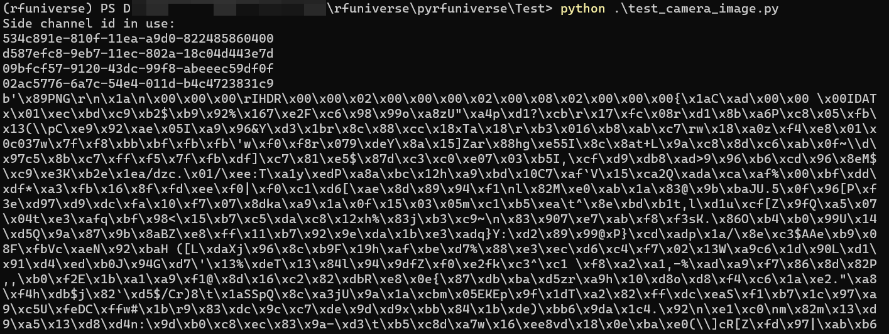

# test_camera_image

## 1. Basic Functionality

Camera Screenshot Example

- Intended Effect
  - Specify the camera position and angle
  - Output and display the image as a PNG byte stream

## 2. Implementation Process

```python
from pyrfuniverse.envs.base_env import RFUniverseBaseEnv
import pyrfuniverse.attributes as attr
import cv2
import numpy as np

env = RFUniverseBaseEnv()

camera = env.InstanceObject(name='Camera', id=123456, attr_type=attr.CameraAttr)
camera.SetTransform(position=[0, 0.25, 0], rotation=[30, 0, 0])
camera.GetDepth(width=512, height=512, zero_dis=1, one_dis=5)
camera.GetDepthEXR(width=512, height=512)
camera.GetRGB(width=512, height=512)
env.step()
```

- Set the initial position and angle of the camera.
- `GetDepth` returns a png in uint8 format, which has lower precision. Therefore, a range needs to be specified, with `zero_dis` as the lower bound and `one_dis` as the upper bound. The depth within this range will be quantized to uint8.
- `GetDepthEXR` outputs the image in EXR format, which supports 32-bit float32, thus eliminating the need for the limitations required by `GetDepth`.

```python
print(camera.data['rgb'])
print(camera.data['depth'])
print(camera.data['depth_exr'])
image_np = np.frombuffer(camera.data['rgb'], dtype=np.uint8)
image_np = cv2.imdecode(image_np, cv2.IMREAD_COLOR)
print(image_np.shape)
env.close()
cv2.imshow("rgb", image_np)
cv2.waitKey(0)
```



- Output image bytes.
- Decode and display the image using the RGB data.

This tutorial segment demonstrates how to capture and display images from a specified camera position and angle within the pyrfuniverse simulation platform, showcasing the capability to output images in different formats and visualize them.