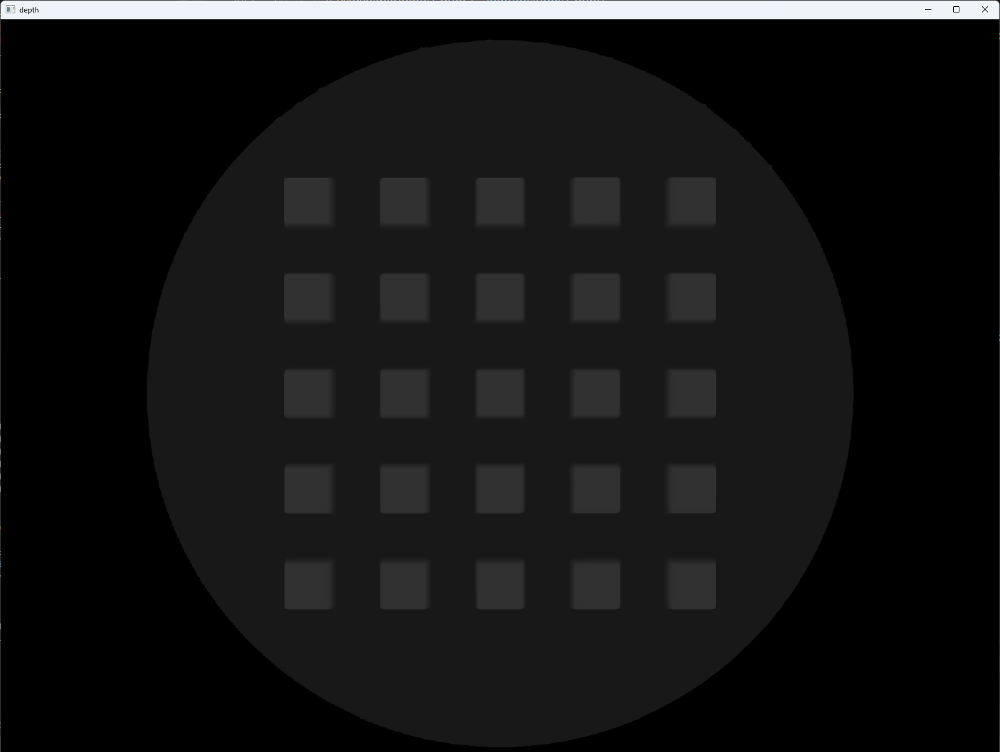

# test_gelslim

## 1 Basic Features




- Demonstrate GelSlim tactile sensor simulation.

## 2 Implementation Process

### 2.1 Initialize the Environment

```python
env = RFUniverseBaseEnv(ext_attr=[GelSlimAttr])
```

### 2.2 Demonstrate GelSlim Tactile Sensor Simulation

```python
gelslim = env.InstanceObject(name="GelSlim", attr_type=GelSlimAttr)
gelslim.SetTransform(position=[0, 0, 0])
target = env.InstanceObject(name="GelSlimTarget", attr_type=attr.RigidbodyAttr)
target.SetTransform(position=[0, 0.03, 0], rotation=[90, 0, 0])
env.SetViewTransform(position=[-0.1, 0.03, 0.], rotation=[0, 90, 0])
```

- `InstanceObject` to instantiate the GelSlim sensor.
- `SetTransform` to set the sensor and object at appropriate positions and orientations.
- `SetViewTransform` to set the viewing angle at an appropriate position and orientation.

```python
for i in range(50):
    env.step()
    target.AddForce([0, -1, 0])
```

- `AddForce` to apply the given force to a rigid body.

```python
gelslim.GetData()
env.step()
image = np.frombuffer(gelslim.data["light"], dtype=np.uint8)
image = cv2.imdecode(image, cv2.IMREAD_COLOR)
cv2.imshow("light", image)
cv2.waitKey(0)
image = np.frombuffer(gelslim.data["depth"], dtype=np.uint8)
image = cv2.imdecode(image, cv2.IMREAD_GRAYSCALE)
cv2.imshow("depth", image)
cv2.waitKey(0)
```

- Call `GetData` on the GelSlim sensor object to retrieve the sensor data, then use the cv2 module to display it.

```python
gelslim.BlurGel()
gelslim.GetData()
env.step()
image = np.frombuffer(gelslim.data["light"], dtype=np.uint8)
image = cv2.imdecode(image, cv2.IMREAD_COLOR)
cv2.imshow("light", image)
cv2.waitKey(0)
image = np.frombuffer(gelslim.data["depth"], dtype=np.uint8)
image = cv2.imdecode(image, cv2.IMREAD_GRAYSCALE)
cv2.imshow("depth", image)
cv2.waitKey(0)
env.Pend()
env.close()
```

- Calling `BlurGel` on the GelSlim sensor object can blur the gel mesh, simulating smooth deformation.