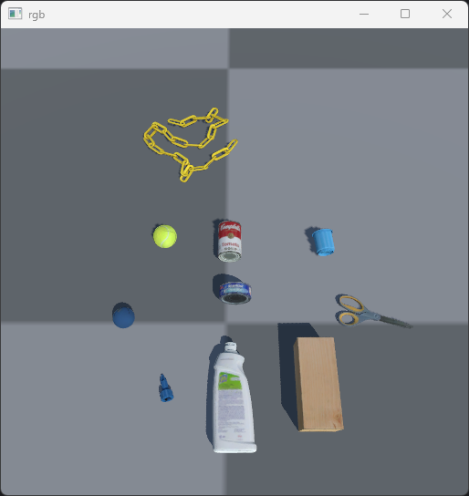

# test_label

## 1 Basic Functions




- Demonstrate 2D scene labeling feature

## 2 Implementation Process

### 2.1 Initialize the Environment

```python
env = RFUniverseBaseEnv(scene_file="SimpleYCBModel.json")
```

### 2.2 Display Interactive Heatmap

```python
camera = env.GetAttr(981613)
camera.GetRGB(512, 512)
camera.GetID(512, 512)
camera.GetNormal(512, 512)
camera.GetDepth(
    0.1,
    2.0,
    512,
    512,
)
camera.GetAmodalMask(655797, 512, 512)
camera.Get2DBBox(512, 512)
camera.Get3DBBox()
```

- Call the camera object's corresponding interface to capture different types of images
    - `GetID`: Obtain the object segmentation image in the scene
    - `GetNormal`: Obtain an image representing the direction of the object's surface normal with color
    - `GetDepth`: Obtain a depth map, the first two parameters are the minimum and maximum distances for the calculation, respectively
    - `GetAmodalMask`: Obtain the amodal mask of a specified object, the first parameter is the object's ID
    - `Get2DBBox`: Obtain the 2D bounding box of the objects in the scene
    - `Get3DBBox`: Obtain the 3D bounding box of the objects in the scene

```python
# rgb
rgb = np.frombuffer(camera.data["rgb"], dtype=np.uint8)
rgb = cv2.imdecode(rgb, cv2.IMREAD_COLOR)
cv2.imshow("rgb", rgb)
cv2.waitKey(0)

# normal
normal = np.frombuffer(camera.data["normal"], dtype=np.uint8)
normal = cv2.imdecode(normal, cv2.IMREAD_COLOR)
cv2.imshow("normal", normal)
cv2.waitKey(0)

# depth
depth = np.frombuffer(camera.data["depth"], dtype=np.uint8)
depth = cv2.imdecode(depth, cv2.IMREAD_COLOR)
cv2.imshow("depth", depth)
cv2.waitKey(0)

# amodal_mask
amodal_mask = np.frombuffer(camera.data["amodal_mask"], dtype=np.uint8)
amodal_mask = cv2.imdecode(amodal_mask, cv2.IMREAD_COLOR)
cv2.imshow("amodal_mask", amodal_mask)
cv2.waitKey(0)

# 2d_bounding_box
id_map = np.frombuffer(camera.data["id_map"], dtype=np.uint8)
id_map = cv2.imdecode(id_map, cv2.IMREAD_COLOR)

print("2d_bounding_box:")
for i in camera.data["2d_bounding_box"]:
    print(i)
    print(camera.data["2d_bounding_box"][i])
    center = camera.data["2d_bounding_box"][i][0:2]
    size = camera.data["2d_bounding_box"][i][2:4]
    tl_point = (int(center[0] + size[0] / 2), int(512 - center[1] + size[1] / 2))
    br_point = (int(center[0] - size[0] / 2), int(512 - center[1] - size[1] / 2))
    cv2.rectangle(id_map, tl_point, br_point, (255, 255, 255), 1)

# 3d_bounding_box
print("3d_bounding_box:")
for i in camera.data["3d_bounding_box"]:
    print(i)
    print(camera.data["3d_bounding_box"][i])

cv2.imshow("id_map", id_map)
cv2.waitKey(0)

env.Pend()
env.close()
```

- Display the obtained images