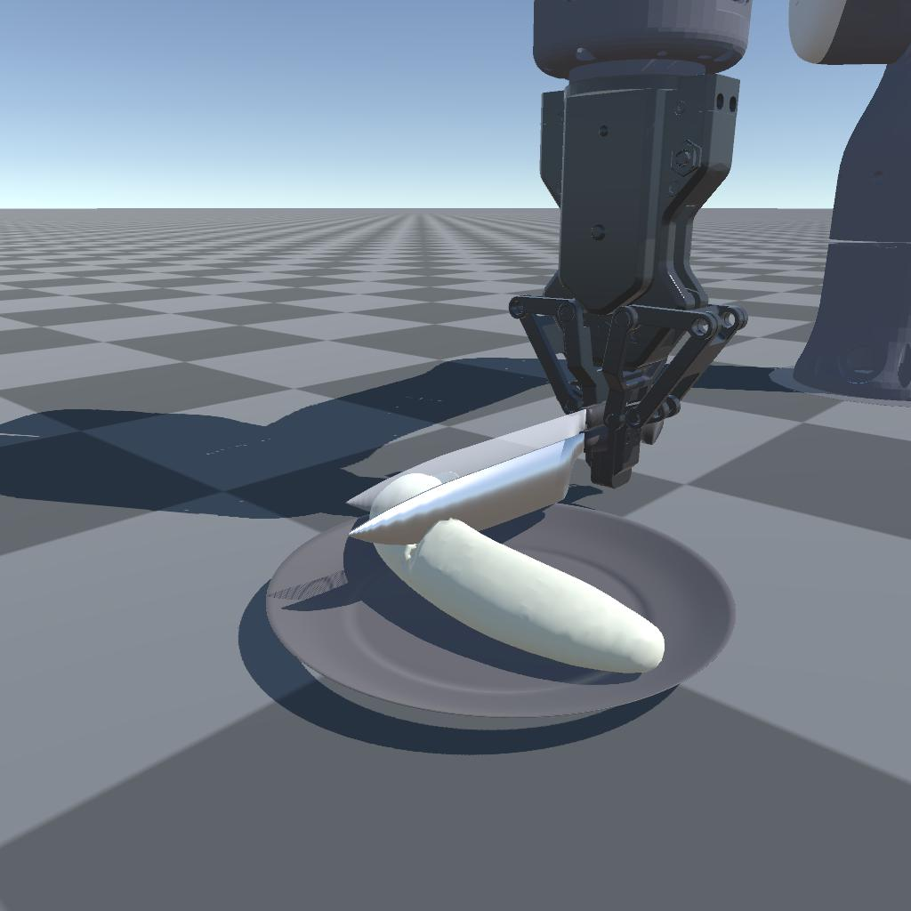
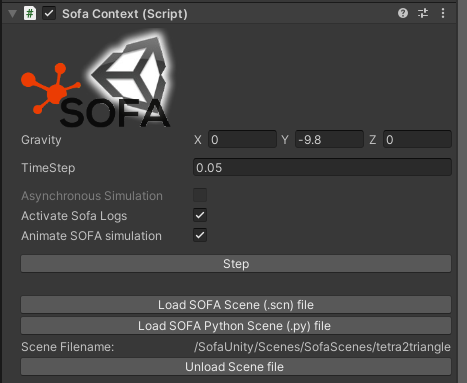
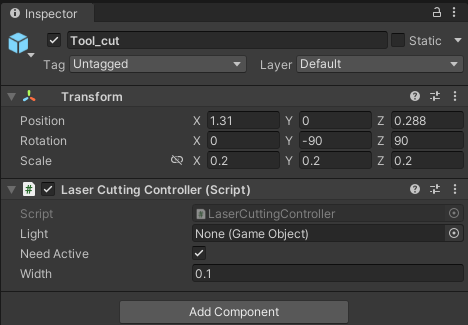
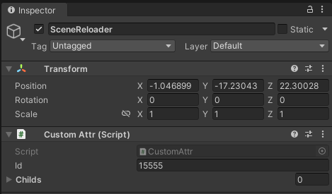

# Flexiv Cutting RL Environment Tutorial

_**This environment has been removed in RFUniverse Release 0.20 and the last available version is 0.13.0**_



In this tutorial, we will continue the multi-physics attributes to set up a goal-conditioned RL environment for cutting banana using Flexiv robot. The cutting is implemented by deleting vertices to a `.msh` file, which contains many vertices at surface as well as inside. The cut object is modeled with FEM. As you can see from the image above, our cutting can achieve real-time and real cutting.

Warning: The plug-in of this scene is only available on Windows platform. If your algorithm needs to run on Linux, we recommend using [Windows WSL](https://learn.microsoft.com/en-us/windows/wsl/install) as the algorithm-end and Windows for the simulation-end. In this way, you do not need to modify any code.

## Quick Start with prebuilt scene

For users who are not familiar with Unity Editor, we have built this scene in the latest version of [RFUniverse Release](https://github.com/mvig-robotflow/rfuniverse/releases). Please download it, follow [README](https://github.com/mvig-robotflow/rfuniverse/blob/main/README.md) to setup your environment and enjoy!

To use this environment, you can use the following code, which is also available [here](https://github.com/mvig-robotflow/pyrfuniverse/blob/main/Test/test_flexiv_cutting_gym.py).

```python
from pyrfuniverse.envs.multi_physics import FlexivCuttingEnv

env = FlexivCuttingEnv()
env.reset()

while 1:
    obs, reward, done, info = env.step(env.action_space.sample())
    if done:
        env.reset()
```

## Build scene in Unity

### Requirements

1. Clone the RFUniverse Unity side repository.
```bash
    git clone https://github.com/mvig-robotflow/rfuniverse.git
```
2. Install the Unity Editor (>= 2021.3) and open the project cloned above.
3. Install [Sofa Unity Plugin](https://www.sofa-framework.org/applications/marketplace/sofa-asset-for-unity3d/).

### Add general prefab into a new scene

This is to add RFUniverse into a newly created scene. This step is the same with previous tutorials.

### Add Flexiv robot with AG95 gripper

Next, we should add a Flexiv robot into this scene. We have also prepared Flexiv robot with AG95 gripper in Assets/Assets/Prefab/Controller/Arm, just drag it into the scene. Don’t forget to drag the robot to Scene Attr under Base Agent (Script) in Inspector window to setup communication. In this experiment, we set the scale to 8.

### Create SOFA Context

Go to the top menu and select `SofaUnity -> SofaContext` to create a `Sofa Context` game object.
<!--  -->


In `Inspector` window, click `Load SOFA Scene (.scn) file`. Here, you can select a load a pre-defined scene file, especially the object and corresponding settings, such as the physics attributes, parameters, gravity, delta time, etc. We have prepared a scene file in the following. This scene contains a banana which is modeled using `.msh` file and it can be cut by laser model (which will introduce later). When the laser model cut the vertices on this banana, the vertices will disappear and the banana will simulate the cutting effect. At the mean time, the banana is modeled with FEM and acts like a soft body.

```xml
<?xml version="1.0" ?>
<Node name="root" dt="0.05" showBoundingTree="0" gravity="0 -9.8 0">
    <RequiredPlugin pluginName='SofaOpenglVisual'/>
    <VisualStyle displayFlags="showVisual" />
    
    <DefaultAnimationLoop />
    <DefaultVisualManagerLoop />
    
    <DefaultPipeline verbose="0" />
    <BruteForceBroadPhase/>
    <BVHNarrowPhase/>
    <DefaultContactManager response="PenalityContactForceField" />
    <MinProximityIntersection name="Proximity" alarmDistance="0.8" contactDistance="0.5" />

    <Node name="LiverVolume">
        <EulerImplicitSolver name="cg_odesolver" printLog="false"  rayleighStiffness="0.1" rayleighMass="0.1" />
        <CGLinearSolver iterations="25" name="linear solver" tolerance="1.0e-9" threshold="1.0e-9" />
        <MeshGmshLoader name="loader" filename="./mesh/banana-big.msh" />
        <!-- <MechanicalObject src="@loader" name="Volume" scale3d="1 1 1" rotation="90 66 0" translation="0.07 0.2 0.6"/> -->
        <MechanicalObject src="@loader" name="Volume" scale3d="1 1 1" rotation="90 0 20" translation="-3 0.2 0"/>

		<TetrahedronSetTopologyContainer  name="TetraContainer" position="@Volume.position" src="@loader" tags=" "/>
		<TetrahedronSetTopologyModifier   name="Modifier" />
		<TetrahedronSetGeometryAlgorithms name="GeomAlgo"  template="Vec3d" />

        <MeshMatrixMass massDensity="1.0" topology="@TetraContainer"/>
        <BoxROI template="Vec3d" box="0 0 0 1 1 1" drawBoxes="1" position="@Volume.rest_position" name="FixedROI"/>
        <!-- <FixedConstraint indices="@FixedROI.indices" /> -->
        <!-- <FastTetrahedralCorotationalForceField name="FEM" youngModulus="1300" poissonRatio="0.3" method="large" />		 -->
		<!-- <TetrahedronFEMForceField name="FEM" youngModulus="1300" poissonRatio="0.3" computeGlobalMatrix="false" 
        method="large" topology="@TetraContainer"/> -->
        <TetrahedronHyperelasticityFEMForceField name="HyperElasticMaterial" materialName="StVenantKirchhoff" ParameterSet="3448.2 31034.4" />
        <PlaneForceField normal="0 1 0" d="0" stiffness="100000" showPlane="1" showPlaneSize="20"/>
        
        <Node name="LiverSurface">
            <TriangleSetTopologyContainer  name="TriContainer" fileTopology="" tags=" " />
			<TriangleSetTopologyModifier   name="Modifier" />
			<TriangleSetGeometryAlgorithms name="GeomAlgo"   template="Vec3d" />
			
            <Tetra2TriangleTopologicalMapping input="@../TetraContainer" output="@TriContainer" />
			<TriangularBendingSprings name="FEM-Bend" stiffness="600" damping="1.0" topology="@TriContainer" />
			<TriangleCollisionModel />
            
            <Node name="LiverVisu">
                <OglModel name="Visual" color="blue" />
                <IdentityMapping input="@../../Volume" output="@Visual" />
            </Node>
        </Node>        
    </Node>
</Node>
```

After saving the scene file above, you can load it in `SOFA Context`. After a short wait, the banana will appear in the scene.

### Add knife-in-hand and target knife

Next, we will work on creating a knife to cut this banana.

First of all, find a knife mesh model and scale it to fit the robot arm. Here we won't constrain the shape or appearance of knife since this is for visualization after all. 

Next, we need to add laser model, which is mentioned above, to this knife. The laser model is an officially supported tool for cutting, attaching and interacting with objects modeled with SOFA-Unity. The original laser model is something different (or totally irrelevant) from knife. However, we can hide the laser model in visulization but leave its effect on knife so that we can achieve the knife cutting. To make the laser model move with knife, we should make it a child game object to the knife. Besides, since the knife is grasped by AG95 gripper, the knife should be a child game object to AG95's grasp point. Put these things together, you can see the following screenshots in `Inspector` window and `Hierarchy` window, where the upper image shows the `Tool_cut` prefab that we make the 'invisible' laser model a prefab, and the lower image shows the relationship among AG95, knife and `Tool_cut`.




The next step is to add a `GameObjectAttr` on knife so that we can get its information directly. We should also drag it to `Agent`.

Finally, there will be a 'shadow' knife showing the target pose of knife. Duplicate the knife model, but remove all colliders and `Tool_cut`, and drag it out from the child to `AG95`. This 'shadow' knife also needs a `GameObjectAttr` that moves in global coordinate, and don't forget to drag it to `Agent`.

## Add custom attributes

The next step is to add custom attributes. There's one problem need to solve: How to reset the scene, or to be more specific, how to restore the cut object if it has changed configuration. One easy way is to make the object addressable and we can destroy it and reload it, just like the solution used in [Kinova Gen2 Catching Cloth task](kinova_cloth). However, `SOFA Context` dosen't support such operation. Thus, here's the final solution: reload the whold scene. Reloading the whole scene means each pre-defined resources will be reloaded and rendered. This is more time-consuming, but there seem to be no other way. Achieving scene reloading in Unity is not difficult, since there's API available. However, when the scene is destroyed, our communication will lose. Fortunately, Unity provides a parameter named `preserved_object`, which means this object can be preserved from being destroyed. We will pass `Agent` to it and implement this in the `CustomAttr.cs`.

```csharp
void ReloadCurrentScene(IncomingMessage msg)
{
    bool preserve = msg.ReadBoolean();
    string preservedObjectName = "";
    if (preserve)
    {
        preservedObjectName = msg.ReadString();
        GameObject preservedObject = GameObject.Find(preservedObjectName);
        DontDestroyOnLoad(preservedObject);
    }

    Scene currentScene = SceneManager.GetActiveScene();
    SceneManager.UnloadSceneAsync(currentScene);
    SceneManager.LoadScene(currentScene.name);
}
```

After the custom attributes are added, there will be a object with `CustomAttr` component so that this function can be called. Achieve this by creating an empty game object named `SceneReloader` and add `CustomAttr` component to it. Don't forget to drag it to `Agent`.



The similar logic is implemented in Python. We leave the `preservedObjectName` as a parameter so that users can also preserve other objects. The codes should be in `custom_attr.py`.

```python
def ReloadCurrentScene(kwargs: dict) -> OutgoingMessage:
    compulsory_params = ['id', 'preserve']
    optional_params = ['preservedObjectName']
    utility.CheckKwargs(kwargs, compulsory_params)

    msg = OutgoingMessage()
    msg.write_int32(kwargs['id'])
    msg.write_string('ReloadCurrentScene')
    msg.write_bool(kwargs['preserve'])
    if kwargs['preserve']:
        msg.write_string(kwargs['preservedObjectName'])

    return msg
```

## Write Python codes

The full version code is available [here](https://github.com/mvig-robotflow/pyrfuniverse/blob/main/pyrfuniverse/envs/multi_physics/flexiv_cutting.py). In this tutorial, we will go through the code and explain some key factors.

### Observations

In this experiment, we pre-set a target pose for knife and want to train robot control end effector to make the knife-in-hand achieve the target pose. Thus, we package it in a goal-conditioned RL environment and collect end effector pose, velocity as well as knife pose and velocity and target pose as the observation.

```python
def _get_obs(self):
    eef_pos = self._get_eef_pos()
    eef_quat = self._get_eef_quat()
    eef_velocity = self._get_eef_velocity()
    robot_obs = np.concatenate((eef_pos, eef_quat, eef_velocity))

    knife_pos = self._get_knife_pos()
    knife_quat = self._get_knife_quat()
    knife_obs = np.concatenate((knife_pos, knife_quat))

    goal_knife_obs = np.concatenate((self.goal[:3], self._get_goal_knife_quat()))

    if self.consider_rotation:
        achieved_goal = knife_obs.copy()
        desired_goal = goal_knife_obs.copy()
    else:
        achieved_goal = knife_pos.copy()
        desired_goal = self.goal.copy()

    return {
        'observation': np.concatenate((robot_obs, knife_obs, goal_knife_obs)),
        'achieved_goal': achieved_goal.copy(),
        'desired_goal': desired_goal.copy()
    }

def _get_eef_pos(self):
    return np.array(self.instance_channel.data[self.object2id['ag95']]['positions'][9]) / self.scale

def _get_eef_quat(self):
    return np.array(self.instance_channel.data[self.object2id['ag95']]['quaternion'][9])

def _get_eef_velocity(self):
    return np.array(self.instance_channel.data[self.object2id['ag95']]['velocities'][9]) / self.scale

def _get_knife_pos(self):
    return np.array(np.array(self.instance_channel.data[self.object2id['knife']]['position']) / self.scale)

def _get_knife_quat(self):
    return np.array(self.instance_channel.data[self.object2id['knife']]['quaternion'])

def _get_goal_knife_quat(self):
    return np.array(self.instance_channel.data[self.object2id['goal_knife']]['quaternion'])

```

### Reset

As we have mentioned before, SOFA objects cannot be reset to its original configuration until the scene is reloaded. Since we have added the functions to reload the current scene, we should call the function during reset to reload the scene. Note that we pass the `preservedObjectName` as `Agent` to preserve it so that the communication will not lose. Besides, we should control the robot to its initial position, which is a common operation.

```python
def reset(self):
    super().reset()
    self.t = 0
    self.eef_euler = self.init_eef_euler.copy()
    self._reload_scene()
    self._init_env_()
    self.goal = self._sample_goal()
    self._set_goal_knife()

    return self._get_obs()

def _reload_scene(self):
    self.instance_channel.set_action(
        'ReloadCurrentScene',
        id=self.object2id['reloader'],
        preserve=True,
        preservedObjectName='Agent'
    )
    self._step()
```

### Step

In `step()` function, we will control the position **and rotation** of the end effector, which result in a larger action space. To lower the difficulty, we limit the range of rotation and control the robot. After simulation, we get the corresponding observation and compute reward.

```python
def step(self, action: np.ndarray):
    assert (action.shape == (4,) and self.consider_rotation) or \
            (action.shape == (3,) and not self.consider_rotation)
    current_pos = self._get_eef_pos()
    delta_pos = action[:3] * 0.05
    target_pos = current_pos + delta_pos

    if self.consider_rotation:
        delta_euler = action[3] * 5
        target_euler = self.eef_euler + np.array([0, delta_euler, 0])
        self.eef_euler = np.clip(
            target_euler,
            a_min=np.array([140, -40, -40]),
            a_max=np.array([220, 40, 40])
        )

    self._set_flexiv(target_pos, self.eef_euler)

    self.t += 1
    obs = self._get_obs()
    info = {
        'is_success': self._check_success(obs['achieved_goal'], obs['desired_goal'])
    }
    reward = self.compute_reward(obs['achieved_goal'], obs['desired_goal'], info)
    done = False

    if self.t == self.max_steps:
        done = True

    return obs, reward, done, info
```
