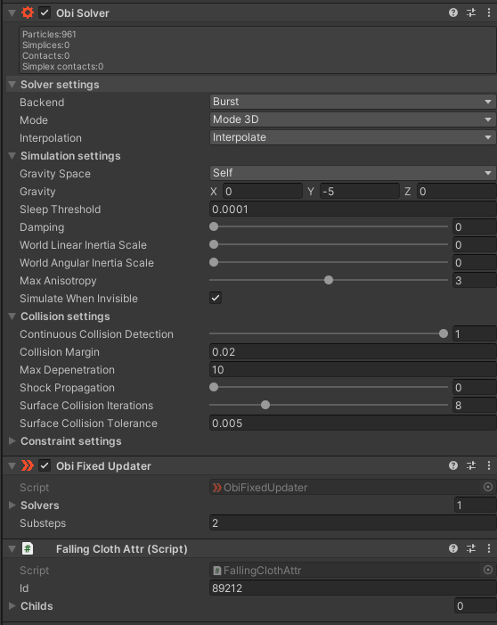
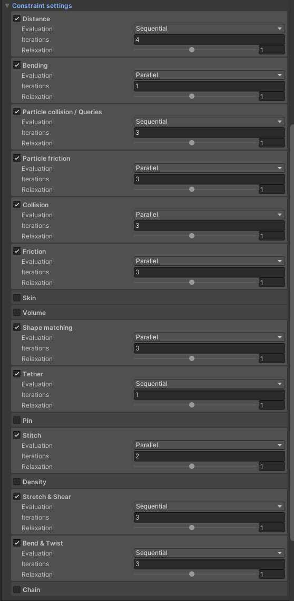
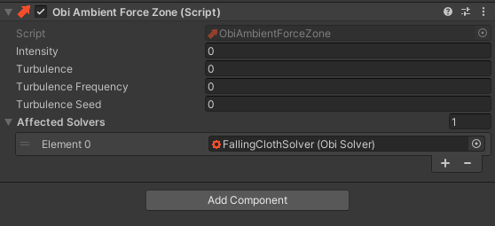
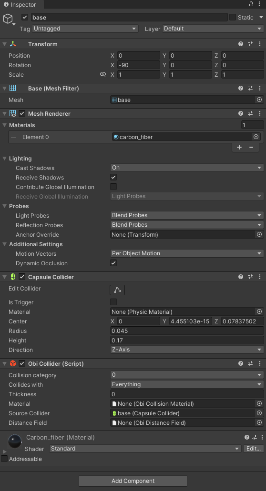

# Kinova Gen2 Catching Cloth RL Environment Tutorial

_**This environment has been removed in RFUniverse Release 0.20 and the last available version is 0.13.0**_


In this tutorial, we will begin the multi-physics attributes in RFUniverse and create a scene in which a Kinova Gen2 robot arm tries to catch the falling cloth object. This environment is also RL-supported and codes will be in OpenAI-Gym style.

## Quick Start with prebuilt scene

For users who are not familiar with Unity Editor, we have built this scene in the latest version of [RFUniverse Release](https://github.com/mvig-robotflow/rfuniverse/releases). Please download it, follow [README](https://github.com/mvig-robotflow/rfuniverse/blob/main/README.md) to setup your environment and enjoy!

To use this environment, you can use the following code, which is also available [here](https://github.com/mvig-robotflow/pyrfuniverse/blob/main/Test/test_catching_cloth_gym.py).

```python
from pyrfuniverse.envs.multi_physics import KinovaGen2CatchingClothEnv

env = KinovaGen2CatchingClothEnv(urdf_file='../Mesh/jaco/j2s7s300_gym.urdf')
env.reset()

while 1:
    obs, reward, done, info = env.step(env.action_space.sample())
    if done:
        env.reset()
```

## Build Scene in Unity

First of all, we should build the scene in Unity Editor. In this experiment, we need a Kinova Gen2 (also known as Jaco) robot and a cloth which can interact with our robot. Besides, thanks to the awesome work of Obi Cloth, we can also add a Force Zone to the cloth to further affect its behavior and interaction to make this task more difficult and interesting. Let's build this scene step by step.

### Requirements

1. Clone the RFUniverse Unity side repository.
```bash
    git clone https://github.com/mvig-robotflow/rfuniverse.git
```
2. Install the Unity Editor (>= 2021.3) and open the project cloned above.
3. Install [Obi Cloth Plugin](https://assetstore.unity.com/packages/tools/physics/obi-cloth-81333).

### Add general prefab into a new scene

The first step is the same as last tutorial. We should create a new scene and load `RFUniverse` prefab from `Assets/RFUniverse/Assets/Prefab`. And remember to remove the original `Main Camera` and `Directional Light`.

### Add Jaco robot to the scene

Next, we should add the robot, our agent, into this scene. We have also prepared Jaco robot in `Assets/Assets/Prefab/Controller/Arm`, just drag it into the scene. Don't forget to drag the robot to `Scene Attr` under `Base Agent (Script)` in `Inspector` window to setup communication.

In this experiment, this robot will interact with a cloth later. However, Obi Cloth cannot simulate with very small cloth size. To make the scale of robot and cloth more suitable, we will scale our Jaco robot to 8.

Scaling robot is very common in simulation, since interacting with deformable objects is complex and with many constrains. Scaling robot or objects can help solve the complexness to some extend.

### Add Obi cloth to the scene

Finally, we will add the cloth to the scene. Right click on the blank space in `Hierarchy` window and select `3D Object -> Obi -> Obi Cloth`. You will see an `ObiSolver` with a `ObiCloth` hierarchical structure appears. Let's rename the `ObiSolver` to `FallingClothSolver` for a more meaningful name.

Then, add a force zone under `ObiSolver`. We do this by adding an empty GameObject under `ObiSolver` and add component named `Obi Ambient Force Zone`. You can leave them here, we will further organize the parameters in the next section.

However, before going ahead, please check [Obi Documentation](http://obi.virtualmethodstudio.com/manual/6.3/backends.html) to setup `Burst` backend. This will enhance the simulation quality and speed.

## Add Custom Attributes

As mentioned in previous pages, we can write custom attributes to support any type of communication. Here we will do something like this. Before writing a custom attribute, we should first think two things:
1. What information or data do we want to get from simulation?
2. How do we want to control the objects in simulation?

First answer the first question: during RL, we may want the number of particles, cloth position, cloth velocity as well as some parameters of force zone so that RL policy can predict the next step.

Then the second question: We may change the gravity of solver to organize the difficulity and change the parameters of force zone to add more randomness.

Thus, we should write two functions in `Attributes`, one for organizing solver gravity and the other for setting force zone parameters; For data communication, we focus on the number of particles, cloth position, cloth velocity as well as parameters of force zone. Together with the grammar in `pyrfuniverse`, we can write codes for our custom `Attributes`, let's name it `FallingClothAttr`, as the following.

```csharp
// C# code, FallingClothAttr.cs
using Robotflow.RFUniverse.SideChannels;
using RFUniverse.Manager;
using UnityEngine;
using System.Linq;
using Obi;

namespace RFUniverse.Attributes
{
    public class FallingClothAttr : BaseAttr
    {
        ObiSolver solver;
        ObiCloth cloth;
        ObiAmbientForceZone forceZone;
        Vector3 lastStepClothPosition;

        public override string Type
        {
            get { return "Falling_Cloth"; }
        }

        protected override void Init()
        {
            base.Init();
            solver = GetComponent<ObiSolver>();
            cloth = GetComponentInChildren<ObiCloth>();
            forceZone = GetComponentInChildren<ObiAmbientForceZone>();
            lastStepClothPosition = new Vector3(-99, -99, -99);
        }
    
        public override void CollectData(OutgoingMessage msg)
        {
            base.CollectData(msg);
            
            int numParticles = cloth.solverIndices.Length;
            Vector3 avgPosition = Vector3.zero;
            for (int i = 0; i < numParticles; ++i)
            {
                avgPosition += cloth.GetParticlePosition(i);
            }
            avgPosition /= numParticles;

            Vector3 avgVelocity;
            if (lastStepClothPosition.y < -50)
            {
                avgVelocity = Vector3.zero;
            }
            else
            {
                avgVelocity = (avgPosition - lastStepClothPosition) / Time.fixedDeltaTime;
            }
            lastStepClothPosition = avgPosition;

            // Number of particles
            msg.WriteInt32(numParticles);
            // Average position
            msg.WriteFloat32(avgPosition.x);
            msg.WriteFloat32(avgPosition.y);
            msg.WriteFloat32(avgPosition.z);
            // Average velocity
            msg.WriteFloat32(avgVelocity.x);
            msg.WriteFloat32(avgVelocity.y);
            msg.WriteFloat32(avgVelocity.z);
            // Force zone parameters
            msg.WriteFloat32(forceZone.transform.eulerAngles.y);
            msg.WriteFloat32(forceZone.intensity);
            msg.WriteFloat32(forceZone.turbulence);
            msg.WriteFloat32(forceZone.turbulenceFrequency);
        }

        public override void AnalysisMsg(IncomingMessage msg, string type)
        {
            switch (type)
            {
                case "SetForceZoneParameters":
                    SetForceZoneParameters(msg);
                    return;
                case "SetSolverParameters":
                    SetSolverParameters(msg);
                    return;
            }
            base.AnalysisMsg(msg, type);
        }

        void SetForceZoneParameters(IncomingMessage msg)
        {
            // Force zone orientation
            if (msg.ReadBoolean())
            {
                forceZone.transform.eulerAngles = new Vector3(0, msg.ReadFloat32(), 0);
            }

            // Force zone intensity
            if (msg.ReadBoolean())
            {
                forceZone.intensity = msg.ReadFloat32();
            }

            // Force zone turbulence
            if (msg.ReadBoolean())
            {
                forceZone.turbulence = msg.ReadFloat32();
            }
            
            // Force zone turbulence frequency
            if (msg.ReadBoolean())
            {
                forceZone.turbulenceFrequency = msg.ReadFloat32();
            }
        }

        void SetSolverParameters(IncomingMessage msg)
        {
            // Solver gravity
            if (msg.ReadBoolean())
            {
                Vector3 gravity = new Vector3(msg.ReadFloat32(), msg.ReadFloat32(), msg.ReadFloat32());
                solver.gravity = gravity;
            }
        }
    }

}
```
```python
# Python file, falling_cloth_attr.py
import pyrfuniverse.attributes as attr
from pyrfuniverse.side_channel.side_channel import (
    IncomingMessage,
    OutgoingMessage,
)
import pyrfuniverse.utils.rfuniverse_utility as utility


def parse_message(msg: IncomingMessage) -> dict:
    this_object_data = attr.base_attr.parse_message(msg)
    this_object_data['num_particles'] = msg.read_int32()
    this_object_data['avg_position'] = [msg.read_float32() for _ in range(3)]
    this_object_data['avg_velocity'] = [msg.read_float32() for _ in range(3)]
    this_object_data['force_zone_orientation'] = msg.read_float32()
    this_object_data['force_zone_intensity'] = msg.read_float32()
    this_object_data['force_zone_turbulence'] = msg.read_float32()
    this_object_data['force_zone_turbulence_frequency'] = msg.read_float32()

    return this_object_data


def SetForceZoneParameters(kwargs: dict) -> OutgoingMessage:
    compulsory_params = ['id']
    optional_params = ['orientation', 'intensity', 'turbulence', 'turbulence_frequency']
    utility.CheckKwargs(kwargs, compulsory_params)

    msg = OutgoingMessage()
    msg.write_int32(kwargs['id'])
    msg.write_string('SetForceZoneParameters')

    # Force zone orientation
    if 'orientation' in kwargs.keys():
        msg.write_bool(True)
        msg.write_float32(kwargs['orientation'])
    else:
        msg.write_bool(False)

    # Force zone intensity
    if 'intensity' in kwargs.keys():
        msg.write_bool(True)
        msg.write_float32(kwargs['intensity'])
    else:
        msg.write_bool(False)

    # Force zone turbulence
    if 'turbulence' in kwargs.keys():
        msg.write_bool(True)
        msg.write_float32(kwargs['turbulence'])
    else:
        msg.write_bool(False)

    # Force zone turbulence frequency
    if 'turbulence_frequency' in kwargs.keys():
        msg.write_bool(True)
        msg.write_float32(kwargs['turbulence_frequency'])
    else:
        msg.write_bool(False)

    return msg


def SetSolverParameters(kwargs: dict) -> OutgoingMessage:
    compulsory_params = ['id']
    optional_params = ['gravity', ]
    utility.CheckKwargs(kwargs, compulsory_params)

    msg = OutgoingMessage()
    msg.write_int32(kwargs['id'])
    msg.write_string('SetSolverParameters')

    # Solver gravity
    if 'gravity' in kwargs.keys():
        msg.write_bool(True)
        msg.write_float32(kwargs['gravity'][0])
        msg.write_float32(kwargs['gravity'][1])
        msg.write_float32(kwargs['gravity'][2])
    else:
        msg.write_bool(False)

    return msg
```

## Organize the parameters and components

### Make the solver compatible

Now that all objects have been added to the scene, we should add components and organize parameters so that they can:
1. Work with `pyrfuniverse`
2. Interact correctly with each other.

Let's start from organizing `FallingClothSolver`. We should add the previous-written `FallingClothAttr` scripts on it so that it can communicate with Python. Besides, organize other parameters according to the following image. For the meaning of these parameters, please refer to [Obi Cloth Manual](http://obi.virtualmethodstudio.com/manual/6.3/clothsetup.html).



Besides, there are more specific settings in Obi. Please click the little triangle on the left side of `Constraint settings` to unfold these settings. Please set them according to the following image. For the details about these settings, please refer to [Obi Constraints](http://obi.virtualmethodstudio.com/manual/6.3/collisions.html).



### Register the Solver to Force Zone

Next, click on the `Force Zone` and you will see it in `Inspector` window. We should drag the solver to the `Affected Solvers` parameter so that the effect of this zone can be added on our cloth.



### Add blueprint and mesh to cloth

Until now, you may still find the cloth invisible in the scene. Don't be afraid, since you will see it after this step. Obi provides many pre-defined blueprints that we can use to simulate cloth. Please click the `Obi Cloth` object and click the right circle on `Mesh` parameter in `Inspector` window. You can find the `cloth_sheet` mesh and add it to `Mesh`. Do the same thing for `Materials`, `Blueprint`, `Collision material` and the following parameters until you get the same setting as the image below. All assets here are available in Obi so we don't need to create from scratch.


### Add Obi Collider to robot.

Until now, we have finished the settings to solver, cloth and force zone. However, our robot cannot interact directly with ObiCloth objects with Unity native collider. To make the robot arm interactable with ObiCloth objects, we should add `ObiCollider` to each part of the robot arm. This process is simple: unfold the hierarchy of Jaco robot and find all game objects that involve `Collider` components. Once you find one, add the `ObiCollider` component to it (just like the following image) and `ObiCollider` will compute its collider based on Unity native collider.



## Make the cloth addressable

Let's move on. Please imagine the RL process. At the beginning, the robot is equipped with a random policy and it cannot catch the cloth. The cloth will fall down on ground until this episode terminates. However, how should we reset the scene? Unfortunately, cloth cannot be controlled with `SetTransform` like the cube in last tutorial. So we must destroy the current cloth and re-load a new one. This will use the addressable asset in `RFUniverse`, which can be loaded during runtime. 

To make the `FallingClothSolver` addressable, we need to first make it a prefab by draging it to any place in `Project` window. After this operation, you will see the logo on the left side of `FallingClothSolver` change to blue. Next, click on the `FallingClothSolver` in `Project` window, and go to the top menu. Find `RFUniverse -> Add to addressable` and click. Things finished!

Don't forget to delete the `FallingClothSolver` in `Hierarchy` window since we will load it during runtime.

## Write Python codes

Until now, we have finished preparation on Unity side. Now let's move to Python side and write the OpenAI-Gym style codes! The full version code is available [here](https://github.com/mvig-robotflow/pyrfuniverse/blob/main/pyrfuniverse/envs/multi_physics/kinova_gen2_catching_cloth_env.py). In this tutorial, we will go through the code and explain some key factors.

### Pre-load assets

We will load `FallingClothSolver` during runtime, so we should pre-load it by passing in parameters.

```python
def __init__(
    self,
    lock_eef_height=False,
    with_force_zone=False,
    force_zone_intensity=1,
    force_zone_turbulence=10,
    max_steps=100,
    cloth_init_pos_min=(-1.5, 8, 3.3),
    cloth_init_pos_max=(1.5, 8, 6.3),
    executable_file=None,
    assets=('FallingClothSolver',),
):
    super().__init__(
        executable_file,
        assets=list(assets)
    )
```

### Get observation

Usually, get observation function will read data which is sent back from Unity. For `eef_position`, `eef_velocity`, we get it from `ControllerAttr` while other observations from `FallingClothAttr`.

```python
def _get_obs(self):
    catcher_position = self._get_eef_position()
    cloth_position = self._get_cloth_position()
    eef_velocity = self._get_eef_velocity()
    cloth_velocity = self._get_cloth_velocity()
    force_zone_parameters = self._get_force_zone_parameters() if self.with_force_zone else np.array([])

    return np.concatenate((catcher_position, cloth_position, eef_velocity, cloth_velocity, force_zone_parameters))

def _get_eef_position(self):
    return np.array(self.instance_channel.data[self.object2id['kinova']]['positions'][15]) / self.scale

def _get_eef_velocity(self):
    return np.array(self.instance_channel.data[self.object2id['kinova']]['velocities'][15]) / self.scale

def _get_cloth_position(self):
    return np.array(self.instance_channel.data[self.object2id['cloth']]['avg_position']) / self.scale

def _get_cloth_velocity(self):
    return np.array(self.instance_channel.data[self.object2id['cloth']]['avg_velocity']) / self.scale

def _get_force_zone_parameters(self):
    return np.array([
        self.instance_channel.data[self.object2id['cloth']]['force_zone_orientation'] / 180 * math.pi,
        self.instance_channel.data[self.object2id['cloth']]['force_zone_intensity'],
        self.instance_channel.data[self.object2id['cloth']]['force_zone_turbulence'],
    ])
```

### Reset scene

During reset, we should first destroy the last cloth and load a new one. The newly loaded cloth will also be affected by a random sampled force zone. Besides, we should also move the robot arm back to its initial pose.

```python
def reset(self):
    self._destroy_cloth()
    self.ik_controller.reset()
    self.t = 0

    init_joint_positions = self.ik_controller.calculate_ik_recursive(
        unity_eef_pos=self.init_eef_pos,
        eef_orn=self.eef_orn
    )
    self._set_kinova_joints_directly(init_joint_positions)
    self._load_cloth()
    
    return self._get_obs()

def _load_cloth(self):
    self.asset_channel.set_action(
        action='InstanceObject',
        name='FallingClothSolver',
        id=self.object2id['cloth']
    )
    self.instance_channel.set_action(
        'SetTransform',
        id=self.object2id['cloth'],
        position=list(self.np_random.uniform(low=self.cloth_init_pos_min, high=self.cloth_init_pos_max)),
    )
    self.instance_channel.set_action(
        'SetSolverParameters',
        attr_name='falling_cloth_attr',
        id=self.object2id['cloth'],
        gravity=[0, -9.8, 0],
    )
    if self.with_force_zone:
        self.instance_channel.set_action(
            'SetForceZoneParameters',
            attr_name='falling_cloth_attr',
            id=self.object2id['cloth'],
            orientation=self.np_random.uniform(-180, 180),
            intensity=self.force_zone_intensity,
            turbulence=self.force_zone_turbulence,
            turbulence_frequency=2,
        )
    self._step()

def _destroy_cloth(self):
    self.instance_channel.set_action(
        action='Destroy',
        id=self.object2id['cloth']
    )
    self._step()
```

### Step

The `step()` function is much simpler since it is similar to last tutorial: just move the robot end effector to a given relative distance. Note that in this task, we will lock the height of end effector to a fixed value to prevent the robot from moving too high and the force zone will take no effect. Besides, if we detect the cloth is lower than a tolerance, this episode will be early done.

```python
def step(self, action: np.ndarray):
    delta_pos = action * 0.05
    curr_pos = self._get_eef_position()
    if self.lock_eef_height:
        target_pos = np.array([
            curr_pos[0] + delta_pos[0], self.kinova_init_y / self.scale, curr_pos[2] + delta_pos[1]
        ])
    else:
        target_pos = curr_pos + delta_pos
    joint_positions = self.ik_controller.calculate_ik_recursive(
        unity_eef_pos=target_pos,
        eef_orn=self.eef_orn
    )
    self._set_kinova_joints(joint_positions)

    self.t += 1
    obs = self._get_obs()
    reward = self._compute_reward(obs)
    done = False
    fail = self._check_fail(obs)
    if fail or self.t == self.max_steps:
        done = True
    if fail:
        reward -= self.max_steps
    info = {
        'is_success': done and not fail
    }

    return obs, reward, done, info
```
